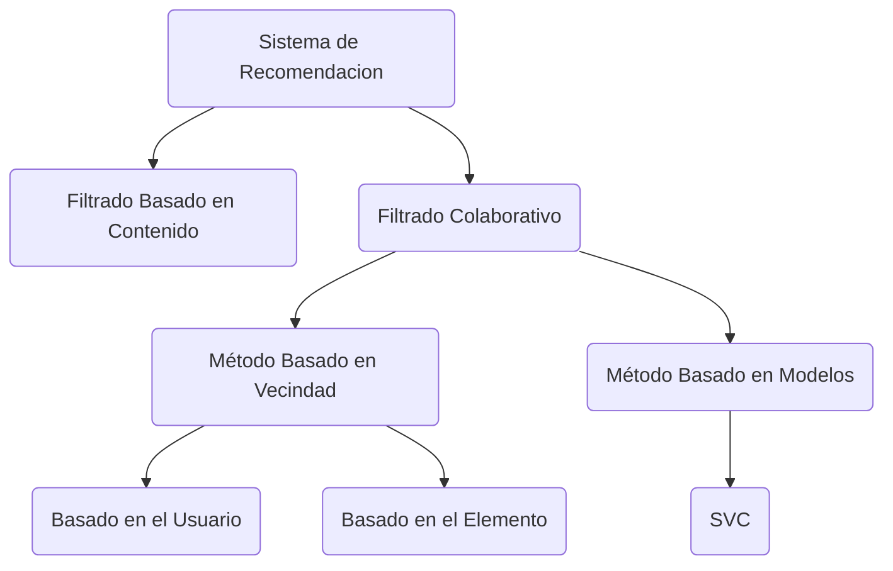

# **Sistemas de Recomendación**

Los sistemas de recomendación son `algoritmos` que filtran y predicen las preferencias del usuario para sugerirle elementos (productos, películas, noticias, etc.) que probablemente le interesen.



**¿Cómo funciona?** Pueden usar enfoques de filtrado colaborativo *(basado en el comportamiento de usuarios similares)*, filtrado basado en contenido *(basado en atributos del ítem)* o una combinación híbrida para generar sugerencias personalizadas.

**Algoritmos comunes:** Filtrado Colaborativo (basado en usuario/ítem), Factorización Matricial (SVD, ALS), Modelos
basados en Redes Neuronales (Deep Learning), Algoritmos de Reglas de Asociación.

---
### Filtrado Colaborativo
---

#### **Método Basado en Vecindad**  
*`K`-`N`earest `N`eighbors (KNN)*

Los métodos basados en vecindad se basan en encontrar vecinos cercanos (usuarios o peliculas) utilizando métricas de similitud como la `similitud del coseno` o el `coeficiente de correlación de Pearson`.

**Basado en usuarios**: Identifica usuarios que tienen gustos similares a los del usuario objetivo y recomienda ítems que a esos usuarios "vecinos" les gustaron, pero que el usuario objetivo aún no ha visto.

**Basado en ítems**: Encuentra ítems similares a los que el usuario ya ha interactuado positivamente y recomienda esos ítems similares.

***Ejemplo***: Si un usuario A y un usuario B han valorado películas de manera similar, y el usuario B ha valorado muy bien una película que el usuario A no ha visto, el sistema podría recomendarle esa película a A. 

**Proceso en el sistema**
1. Obtener el promedio de ratings realizado en por usuario y por película
```
grupo = ratings.groupby(["movieid"])["rating"]
rating_movies_promedio = grupo.mean()
rating_movies_conteo = grupo.count()
```
2.