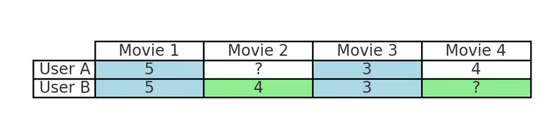

# Filtrado Colaborativo vs. Filtrado Basado en Contenido

[Fuente de Información](https://www.datacamp.com/es/tutorial/collaborative-filtering)

El filtrado colaborativo recomienda artículos identificando **patrones en el comportamiento** de los usuarios, como valoraciones, compras o clics. Se basa únicamente en interacciones pasadas y similitudes entre usuarios para hacer predicciones. 

El **filtrado basado en el contenido** se centra más en las *características de los propios artículos*, como géneros, descripciones de productos o palabras clave, para recomendar artículos similares a los que le han gustado antes a un usuario.

Los **sistemas híbridos** reúnen ambas cosas. Se sabe que los sistemas híbridos mejoran la precisión porque, al combinar los datos de comportamiento con los atributos de los artículos, abordan limitaciones como el problema del arranque en frío, en el que los nuevos usuarios o artículos tienen pocos o ningún dato histórico.

## Cómo Funciona

### Filtrado Colaborativo

El filtrado colaborativo funciona identificando patrones en el comportamiento de los usuarios para agrupar usuarios o elementos similares y generar recomendaciones.

Por ejemplo, si sueles ver películas de acción en Netflix, el filtrado colaborativo identificará a otros usuarios con hábitos de visionado similares y te recomendará películas que esos usuarios disfrutaron pero que tú aún no has visto. Este proceso refleja la forma en que los amigos recomiendan contenidos basándose en intereses compartidos, aprovechando las preferencias colectivas de los usuarios en lugar de las características de los artículos.

Una tabla sencilla que muestra el Filtrado Colaborativo Basado en Usuarios. La tabla tiene dos usuarios (Usuario A y Usuario B) que valoran cuatro películas. El Usuario A y el Usuario B han dado puntuaciones similares a la Película 1 y a la Película 3. Como el Usuario B ha valorado la Película 2 con un 4, pero el Usuario A aún no la ha visto, el sistema recomienda la Película 2 al Usuario A. La tabla resalta las valoraciones similares en azul y la película recomendada en verde

Por ejemplo, en la tabla anterior:

El Usuario A y el Usuario B han dado valoraciones similares a la Película 1 y a la Película 3, lo que significa que tienen gustos similares.
Dado que el Usuario B ha visto y le ha gustado la Película 2 (valoración: 4) pero el Usuario A aún no la ha visto, el sistema recomienda la Película 2 al Usuario A, igual que Netflix sugeriría películas disfrutadas por usuarios con patrones de visionado similares.

### Medidas de similitud

Las medidas de similitud ayudan a cuantificar lo parecidos que son los usuarios o los objetos. Los métodos más utilizados son:

**Similitud del coseno:** Mide el coseno del ángulo entre dos vectores en un espacio multidimensional. La similitud del coseno es especialmente útil para los datos dispersos, ya que capta las relaciones basándose en patrones de interacción y no en valores absolutos. 

**Correlación de Pearson:** Mide la correlación lineal entre las valoraciones de usuarios o ítems. Merece la pena señalar que esta métrica se utiliza normalmente cuando los patrones de valoración de los usuarios se ajustan a la media, porque elimina cualquier sesgo que pudiera producirse cuando diferentes usuarios tienen diferentes líneas de base de valoración. 

### Tipos de filtrado colaborativo

#### Enfoques basados en la memoria 

**Filtrado basado en el usuario:** Identifica a los usuarios con un comportamiento similar y recomienda los artículos que les han gustado.

**Filtrado basado en elementos:** Recomienda artículos basándose en la similitud con los que le han gustado previamente al usuario. Este método es más escalable, ya que los objetos suelen tener patrones de interacción más estables que los usuarios.

#### Enfoques basados en modelos 

**Factorización de matrices:** Reduce la dimensionalidad de la matriz usuario-elemento para descubrir patrones ocultos (por ejemplo, Descomposición de Valores Singulares).

**Redes neuronales:** Captar patrones complejos en el comportamiento del usuario para obtener recomendaciones más precisas (por ejemplo, el filtrado neuronal colaborativo). 

